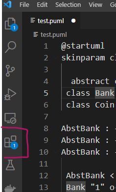
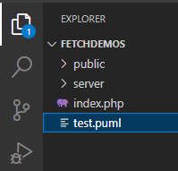
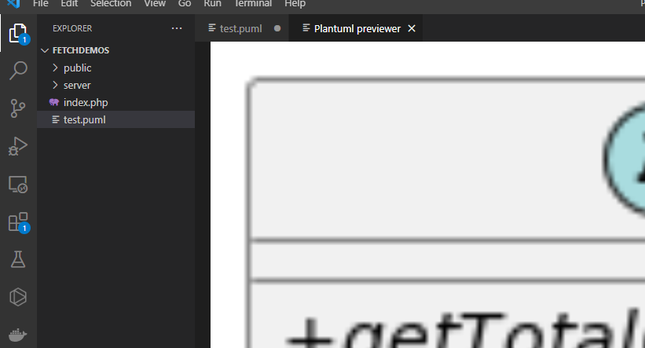
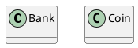
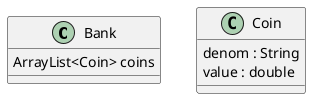
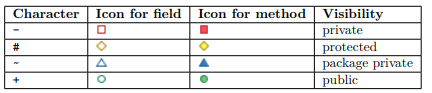
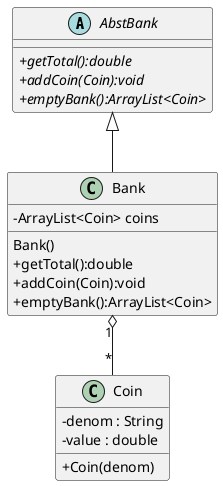
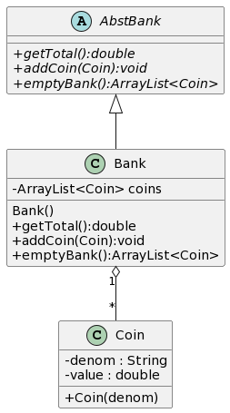

# Using PlantUML in VS Code to make UML Class Diagrams
### TLDR 
- Add the extension to VSCode: PlantUML Previewer
- Use this document to create .puml files for your class diagrams
- use CTRL-P to see the image generated.
- drag the image to the url bar in chrome to get an image you can download or save.
---
Section| Topic | Author | Date
|---|---|---|---
1.0|[The PlantUML VS Code Extension](#the-plantuml-vs-code-extension)|NR|03-02-23
2.0|[Class Diagram Basics](#class-diagram-basics)| NR| 03-02-23
3.0|[Relationships Between Classes](#relationships-between-classes) |NR|TODO
4.0|[Class Diagram Extras](#class-diagram-extras)| NR | TODO
5.0|[Getting Your Image](#getting-the-image) | NR | TODO
6.0|[Example](#Example) | NR | TODO


# The PlantUML VS Code Extension
<details>
  <summary>
    Topics<br>
  * Setup in VS Code<br>
  * File Setup<br>
  * Getting the Preview
  </summary>
  
  ### Setup in VS Code
  1. Click on the extensions icon in the VS Code sidebar 
  
  2. Search for "plantuml"
  3. Install the PlantUML Previewer extension
     
  ### File Setup
  All plantUML files must have the file extension ".puml"
  

  ### Getting the Preview
  With the puml file open, ctrl-p opens a new tab with an image of the preview included. Any errors will also be explained inside.
  
  
</details>

# Class Diagram Basics
<details>
  <summary>
    Topics<br>
  * Starting the Class Diagram<br>
  * Adding in Classes<br>
  * Adding in Properties and Methods<br>
  * Setting Scope Visibility
  </summary>
  
  ### Starting the Class Diagram
 Plant UML can do more than just class diagrams and so we need to be able to tell it that we are making a class diagram and where it starts and ends.
 ```puml
@startuml

@enduml
```

  ### Adding in Classes
  Adding classes to your diagram is done almost like a variable declaration in any language.

<strong>Note that classes can be delared together or grouped together with their properties and methods.</strong>

### Adding in Properties and Methods
Below are some samples of adding in properties.

Adding methods is very similar.
```puml
 Bank : Bank()
 Bank : getTotal():double
 Bank : addCoin(Coin):void
 Bank : emptyBank():ArrayList<Coin>
 
 Coin : +Coin(denom)
```
<strong>Note the constructor as the first method above</strong>
### Setting Scope Visibility
Setting visibility comes from using the symbols you already know.

These are added by placing the appropriate symbol infront of the method or property.

</details>

# Example
Below is example code which features most of the features we will use in this class.

Which yields the below image.<br>

